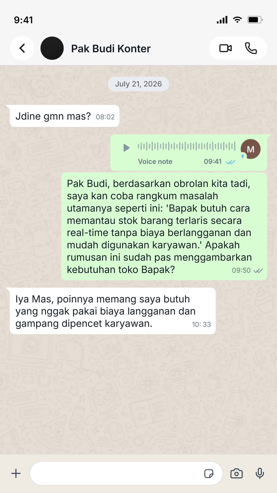

## Kompetensi target

Mendengar sebelum proposing dan membangun shared problem statement dengan person.

## Evidence wajib

- Initial assumption dan pertanyaan discovery.
- Transcript/paraphrase serta problem impact dan constraint.
- Shared problem statement yang dikonfirmasi partner.

::: {.callout-tip title="Lihat contoh pengisian"}
[Buka contoh fiktif Minggu 5](../examples/week-05.qmd) untuk melihat tingkat kekonkretan evidence dan analisis. Jangan menyalin contoh sebagai evidence pribadi.
:::

## Initial assumption dan rencana discovery

Saya berasumsi bahwa toko ritel UMKM sering kehilangan potensi penjualan karena mereka tidak menggunakan sistem kasir otomatis (POS) berbasis *barcode scanner*. Saya mewawancarai Pak Budi, seorang pemilik toko aksesori komputer dan HP lokal, sebelum mengusulkan pembuatan sistem pencatatan inventaris digital (*no-code*).

Pertanyaan penemuan utama:
1. Bisa ceritakan kejadian terakhir kali Bapak merasa kewalahan mengurus stok barang?
2. Kalau sampai kehabisan stok tanpa sadar, kerugian paling besar apa yang Bapak rasakan?
3. Selain Bapak, siapa lagi di toko ini yang kena imbas dari masalah tersebut?
4. Seandainya masalah ini beres, Bapak membayangkan proses cek barang yang ideal itu seperti apa?
5. Apakah ada batasan (biaya/alat/kemampuan staf) kalau kita mau merapikan sistem ini?

## Potongan transcript

> **Saya:** "Waktu Bapak harus ngecek barang di gudang tengah malam, kerugian paling besar yang dirasakan apa?" *(Menyelidiki Dampak)*  
> **Pak Budi:** "Waktu istirahat habis, Mas. Belum lagi pembeli yang siang udah telanjur kabur ke toko sebelah karena kita nggak tau kalau kabel *charger* udah habis duluan."  
> **Saya:** "Jadi masalah utamanya bukan cuma pencatatannya capek, tapi informasi stok yang putus membuat toko kehilangan pemasukan ya, Pak?" *(Parafrasa)*  
> **Pak Budi:** "Betul, pokoknya saya pengen tau kapan barang mau habis sebelum pembeli nanya." *(Aspirasi)*  
> **Saya:** "Kalau saya pasangkan sistem POS *barcode* komplit dengan komputer dan *database* berbayar, kira-kira solusi itu cocok nggak?" *(Mencoba validasi asumsi awal)*  
> **Pak Budi:** "Wah, jangan yang mahal-mahal. Toko kecil nggak ada biaya *maintenance* langganan bulanan *software*. Lagian, karyawan saya ini lulusan SMA yang nggak biasa pakai aplikasi komputer ribet." *(Constraint)*

## Pembaruan pembacaan

Asumsi awal bahwa klien "membutuhkan sistem *barcode* canggih" terbukti keliru dan tidak relevan dengan *constraint* klien. Evidence wawancara mengungkap tiga parameter utama: hilangnya pendapatan (*impact*), staf yang kurang literasi digital (*constraint 1*), dan tidak adanya anggaran *software* berlangganan (*constraint 2*).

**Shared problem statement yang dikonfirmasi Pak Budi:**

> "Pemilik toko ritel aksesori mengalami kekosongan stok barang terlaris tanpa peringatan ketika pembeli sedang ramai, sehingga kehilangan potensi penjualan dan waktu istirahat harian karena harus melakukan perhitungan manual. Ia membutuhkan cara melacak ketersediaan barang secara akurat, dengan mempertimbangkan ketiadaan anggaran untuk perangkat lunak mahal dan staf toko yang belum fasih teknologi IT."

Pak Budi setuju dengan rumusan ini karena tidak menyodorkan solusi komputerisasi yang membebani keuangannya, melainkan menyoroti kebutuhannya akan *tracking* sederhana yang *budget-friendly*.

## Evidence, feedback, dan next step

- Transkrip percakapan luring 15 menit, disusun menjadi catatan tertulis dengan persetujuan penggunaan data non-rahasia.
- Pesan WhatsApp dari Pak Budi yang memvalidasi *problem statement* ("Iya Mas, poinnya memang saya butuh yang nggak pakai biaya langganan dan gampang dipencet karyawan"). {#fig-whatsapp width=60% fig-align="center"}
- **Next practice:** Karena kendala biaya dan teknis telah diketahui, rencana tindak lanjut saya adalah mendesain purwarupa (*prototype*) sistem inventaris memanfaatkan *web app no-code* gratis (seperti Odoo via *browser* HP) dan memvalidasi antarmukanya (*UI*) kepada karyawan tokonya secara langsung.

AI (Gemini) digunakan secara etis sebagai cermin diskusi. Saya memberikan draf *problem statement* awal dan Gemini mendeteksi bahwa saya memasukkan frasa *"aplikasi berbasis web"* di dalamnya. Sesuai panduan *Golden Rule*, AI menyarankan menghapus frasa tersebut agar murni berorientasi pada "kebutuhan fungsi", bukan "pemilihan solusi".

## Self-assessment

| Dimensi | Skor | Evidence singkat |
|---|---:|---|
| Person & Character | 4 | Realita emosional (kehilangan waktu istirahat) dan keterbatasan teknis karyawan terpetakan. |
| Objective & State | 4 | Asumsi awal (sistem *barcode* canggih) diperbarui secara objektif menjadi *problem statement* yang relevan. |
| Repertoire, Language & AI | 3 | Menggunakan 5 pertanyaan penemuan, parafrasa aktif, dan AI sebagai *reviewer* draf tanpa melanggar batas privasi. |
| Response & Adaptation | 4 | Menahan dorongan ego (*curse of knowledge*) untuk mendiktekan *software ERP* rumit setelah mendengar respons soal *budget*. |
| Agreement, Action & Relationship | 3 | Kesepakatan pada *problem statement* disetujui tanpa janji berlebihan, memuluskan langkah *prototyping* berikutnya. |

**Total: 18/20.**

::: {.assessor-only}
### Assessment dosen
**Skor:** — / 20  
**Evidence yang mendukung:** —  
**Prioritas perbaikan:** —  
**Keputusan:** Belum dinilai / Perlu revisi / Tercapai  
:::